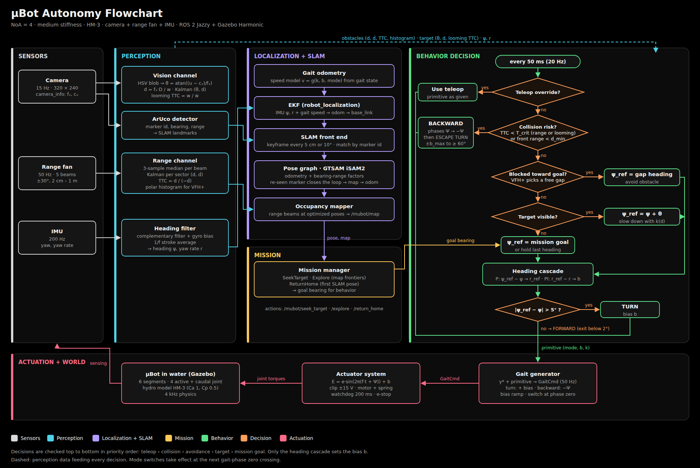

# System architecture



Source: `figures/autonomy_flowchart.svg`, drawn by `tools/draw_autonomy_flowchart.py`.

Rendered versions with diagrams: `html/ros2_architecture.html` (this design)
and `html/ros1_full_stack.html` (the same design described on ROS 1).

## Process layout

```
GZ SIM SERVER (gz-transport)        BRIDGE                         ROS 2 GRAPH (DDS)
 MuBotHydro system           ◄──── mubot_gz_cmd_bridge ◄── GaitCmd ── [container: perception → behavior → gait_generator]
 MuBotActuator system               (custom messages)                  ekf_node · slam_node
 Sensors (camera, gpu_lidar)  ────► ros_gz_bridge  ──── ROS topics ──► mission · teleop
 Imu · JointState · Odometry        (bridge.yaml)                      supervisor + lifecycle_manager
 World control (reset/step)  ◄────                ◄──── e-stop ─────── robot_state_publisher · rviz2 · ros2 bag
```

## Data flow in deploy mode

```
sensors ─► perception ─► (heading, obstacles, target, landmarks)
                │                      │
                ▼                      ▼
     gait_odometry + EKF ─► slam_node ─► pose, map ─► mission ─► goal
                                                        │
                                   behavior: state machine + arbiter + heading cascade
                                                        │ primitive (mode, b, k)
                                                        ▼
                                   gait_generator ─► GaitCmd ─► actuator system
```

## Nodes

| Node | Package | Role |
|---|---|---|
| perception | mubot_perception | heading filter, range channel, vision channel, ArUco landmarks |
| behavior | mubot_control | state machine, priority arbiter, VFH+, heading cascade |
| gait_generator | mubot_control | γ* + primitive → GaitCmd; publishes GaitState |
| twist_to_primitive | mubot_control | cmd_vel (Nav2, teleop) → k, b |
| gait_odometry | mubot_localization | speed model → twist for the EKF |
| ekf_node | robot_localization | odom → base_link |
| slam_node | mubot_localization | map → odom, landmarks, occupancy grid |
| mission | mubot_mission | SeekTarget, Explore, ReturnHome actions |
| supervisor | mubot_bringup | mode, lifecycle, e-stop, diagnostics |
| robot_state_publisher | standard | /joint_states → /tf |
| mubot_gz_cmd_bridge | mubot_gazebo | GaitCmd ↔ gz Double_V |

## Topics

| Topic | Type | Rate | From → to |
|---|---|---|---|
| `/clock` | rosgraph_msgs/Clock | sim | Gazebo → all |
| `/mubot/imu` | sensor_msgs/Imu | 200 Hz | Gazebo → perception |
| `/mubot/range` | sensor_msgs/LaserScan | 50 Hz | Gazebo → perception, slam |
| `/mubot/camera/image_raw` | sensor_msgs/Image | 15 Hz | Gazebo → perception |
| `/mubot/camera/camera_info` | sensor_msgs/CameraInfo | 15 Hz | Gazebo → perception |
| `/joint_states` | sensor_msgs/JointState | 100 Hz | Gazebo → robot_state_publisher |
| `/tf`, `/tf_static` | tf2_msgs/TFMessage | varies | rsp, EKF, slam → all |
| `/mubot/odom` | nav_msgs/Odometry | 100 Hz | Gazebo ground truth → evaluation only |
| `/mubot/perception/heading` | std_msgs/Float64 | 200 Hz | perception → behavior |
| `/mubot/perception/yaw_rate` | std_msgs/Float64 | 200 Hz | perception → behavior |
| `/mubot/perception/obstacles` | mubot_interfaces/ObstacleArray | 50 Hz | perception → behavior |
| `/mubot/perception/target` | mubot_interfaces/Target | 15 Hz | perception → behavior |
| `/mubot/perception/landmarks` | mubot_interfaces/LandmarkArray | 15 Hz | perception → slam |
| `/mubot/odometry/filtered` | nav_msgs/Odometry | 50 Hz | EKF → slam |
| `/mubot/pose` | geometry_msgs/PoseWithCovarianceStamped | keyframe | slam → behavior, mission |
| `/mubot/landmarks` | visualization_msgs/MarkerArray | on update | slam → mission, RViz |
| `/mubot/map` | nav_msgs/OccupancyGrid | 2 Hz | slam → mission, RViz |
| `/mubot/goal` | actions SeekTarget, Explore, ReturnHome | on demand | mission → behavior |
| `/mubot/primitive` | mubot_interfaces/Primitive | 20 Hz | behavior → gait_generator |
| `/mubot/primitive_override` | mubot_interfaces/Primitive | on input | teleop → behavior |
| `/mubot/gait_cmd` | mubot_interfaces/GaitCmd | 50 Hz | gait_generator → actuator system |
| `/mubot/gait_state` | mubot_interfaces/GaitState | 50 Hz | gait_generator → gait_odometry, perception |
| `/mubot/gait_odometry/twist` | geometry_msgs/TwistWithCovarianceStamped | 50 Hz | gait_odometry → EKF |
| `/mubot/estop` | std_msgs/Bool (transient local) | latched | supervisor → actuator system |
| `/mubot/actuator_state` | mubot_interfaces/ActuatorState | 50 Hz | actuator system → supervisor, logging |
| `/diagnostics` | diagnostic_msgs/DiagnosticArray | 1 Hz | all → supervisor |

## Timing

| Loop | Rate |
|---|---|
| Physics, hydro, waveform | 4 kHz (0.25 ms step) |
| IMU / range / camera | 200 / 50 / 15 Hz |
| Gait command stream | 50 Hz |
| EKF | 50 Hz |
| Arbiter + heading cascade | 20 Hz |
| SLAM keyframes | every 5 cm or 10° |
| Occupancy grid | 2 Hz |
| Command watchdog | 200 ms timeout |

## Safety

- The actuator system ramps to zero voltage if `/mubot/gait_cmd` stops for
  200 ms or `/mubot/estop` is true.
- Command topics carry a 100 ms QoS deadline, so the supervisor hears about a
  stalled publisher before the watchdog trips.
- Teleop has top priority in the arbiter.
